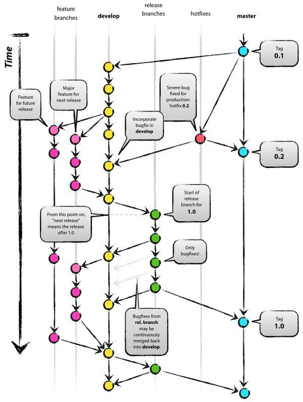

# Git 代码规范

## 分支命名

### master

master 分支为主分支，用于部署生产环境的分支，需要确保 master 分支的稳定性，不允许直接提交代码，只能通过 pull request 方式提交代码。

### develop

develop 分支为开发分支，用于开发新功能或修改功能，需要确保 develop 分支的稳定性，不允许直接提交代码，只能通过 pull request
方式提交代码。一般开发新功能时，feature 分支从 develop 分支创建，feature 分支完成后，需要合并到 develop 分支，然后删除
feature 分支。

### feature

feature 分支为功能分支，分支以 `feature/` 开头，后面加上开发的功能模块，例如 `feature/user_module`，`feature/core_module` 等。

### test 分支

test 分支为测试环境分支，外部用户无法访问，专门给测试人员使用。

### release 分支

release 为预上线分支，UAT 测试阶段使用。不建议直接在 release 分支上直接修改代码。

### hotfix 分支

hotfix 为紧急修复分支，用于修复 master 分支上的紧急问题。修复完成后，需要合并到 master 分支和 develop 分支。命名规则和
feature 分支类似。

### 分支与环境的对应关系

在系统开发过程中常用的环境：

- DEV 环境（Development environment）：用于开发者调试使用
- FAT 环境（Feature Acceptance Test environment）：功能验收测试环境，用于测试环境下的软件测试者使用
- UAT 环境（User Acceptance Test environment）：用户验收测试环境，用于生产环境下的软件测试者使用
- PRO 环境（Production environment）：生产环境

分支与环境的对应关系如下：

| 分支      | 环境  |
|---------|-----|
| master  | PRO |
| develop | DEV |
| feature |     |
| test    | FAT |
| release | UAT |
| hotfix  |     |

## 合并流程规范

参考业内常见的分支声明周期，分为两大主分支（develop 和 master）、小分支（feature、release、hotfix）和临时分支（test）。
它们的声明周期如下图所示：

需要保证以下流程：

1. develop 分支和 hotfix 分支，必须从 master 分支检出
2. 由 develop 分支创建 test 分支
3. 功能测试无误后，由 test 分支合并到 release 分支
4. UAT 测试通过后，由 release 分支合并到 master 分支
5. 对于工作量小的功能开发，可以直接在 develop 分支进行开发，否则由 develop 分支检出 feature 分支进行开发，开发完后在合并到 develop 分支

## type 规范

参考 Angular Git Commit Guidelines 中推荐的 type 类型，常用的 type 规范如下：

- feat: 新功能（feature）
- fix: 修补 bug
- docs: 文档（documentation）
- style: 格式（不影响代码运行的变动）
- refactor: 重构（即不是新增功能，也不是修改 bug 的代码变动）
- perf: 性能优化
- test: 增加测试
- chore: 构建过程或辅助工具变动
- revert: 回滚
- wip: 开发中
- delete: 删除功能或文件
- modify: 修改功能
- build: 改变构建流程，新增依赖库、工具等（如 webpack、gulp、npm、maven 修改）
- ci: 持续集成，自动化流程配置修改

> 注意事项
> 
> 对于单次提交，需要注意以下几点：
> 1. 提交问题必须为同一类型
> 2. 提交问题不要超过 3 个
> 3. 提交的 commit 发现不规范，需要修改，请使用 `git commit --amend` 命令或 `git reset --hard HEAD`，修改后再次提交。

## 其他

下面是一些建议：
- master 分支的每一次更新，都建议打 tag 添加标签，通常为对应版本号，便于管理
- feature 分支，hotfix 分支在合并后可以删除，避免分支过多造成管理混乱
- 每次 pull 请求前，提交本地代码到本地仓库，否则可能出现合并代码出错，导致代码丢失

